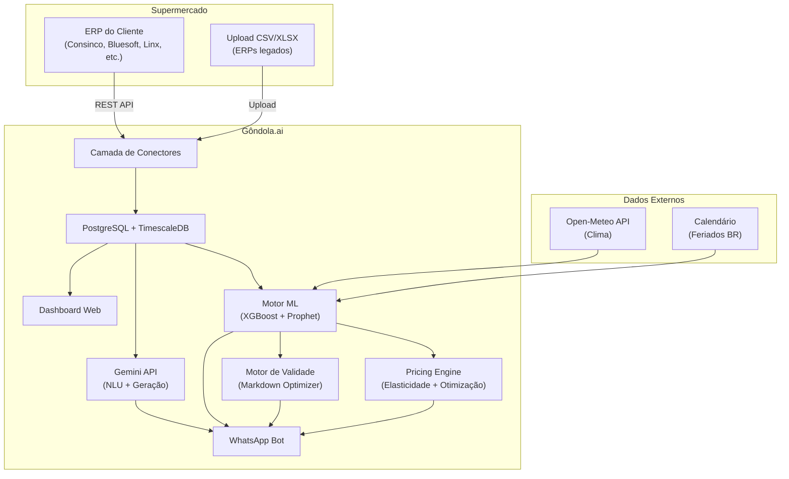

# Plano de Integração Plug-and-Play — Gôndola.ai × ERPs de Supermercados

## Contexto

O Gôndola.ai precisa consumir dados de vendas, estoque e produtos de supermercados que utilizam diferentes sistemas de ERP. Este plano detalha a arquitetura de integração agnóstica que permitirá ao Gôndola.ai funcionar como uma "camada inteligente" sobre qualquer ERP do mercado.

---

## 1. Mapeamento dos Principais ERPs de Supermercados no Brasil

| ERP | Empresa | Porte Alvo | Método de Integração | Status da API |
|---|---|---|---|---|
| **Consinco** | TOTVS Varejo Supermercados | Médio/Grande | **REST API** (TDN — TOTVS Developer Network) | ✅ Documentada — APIs de produtos, preços, média de vendas, estoque |
| **Bluesoft ERP** | Bluesoft | Médio/Grande | **REST API** com Token Auth | ✅ Documentada em `erp.bluesoft.com.br/api/` — produtos, clientes, fornecedores, pedidos |
| **Linx ERP / Microvix** | Linx (Stone) | Todos os portes | **REST API** ("API First") | ✅ Documentada — exemplos em Python, PHP, Ruby, Java |
| **Solidcon (ERP SMart)** | Solidcon | Pequeno/Médio | Ecossistema de integrações (parceiros) | ⚠️ Integrações via parceiros (iFood, CRM, etc.), API própria não pública |
| **Sistema S** | Telecon Sistemas | Pequeno/Médio | Banco de Dados + integrações pontuais | ⚠️ Integração direta no BD (ex: Mercafacil), sem API REST pública documentada |
| **VR Software** | VR Software | Todos os portes | Interna (só para produtos VR) | ❌ Fechada — IA exclusiva para clientes VR |
| **TOTVS Protheus** | TOTVS | Médio/Grande | **REST API** | ✅ Documentada via TDN |
| **SAP Business One** | SAP | Médio/Grande | **REST API** (Service Layer) | ✅ Documentada |

---

## 2. Arquitetura Proposta: O "Adapter Pattern"

A chave para o plug-and-play é usar o **padrão Adapter** (ou Connector). Cada ERP terá um "conector" dedicado que traduz os dados daquele ERP para o formato universal do Gôndola.ai.

```
┌─────────────────────────────────────────────────────────┐
│                      GÔNDOLA.AI                         │
│                                                         │
│   ┌───────────┐   ┌──────────┐   ┌───────────────────┐  │
│   │ Motor IA  │   │ WhatsApp │   │  Dashboard Web    │  │
│   │ Preditivo │   │ Chatbot  │   │  (Admin Panel)    │  │
│   └─────┬─────┘   └────┬─────┘   └────────┬──────────┘  │
│         │              │                   │             │
│   ┌─────▼──────────────▼───────────────────▼──────────┐  │
│   │         CAMADA DE DADOS UNIFICADA                 │  │
│   │   (Modelo Canônico: produtos, vendas, estoque)    │  │
│   └─────────────────────┬─────────────────────────────┘  │
│                         │                                │
│   ┌─────────────────────▼─────────────────────────────┐  │
│   │           CAMADA DE CONECTORES (Adapters)          │  │
│   │                                                    │  │
│   │  ┌──────────┐ ┌────────┐ ┌──────┐ ┌───────────┐   │  │
│   │  │ Consinco │ │Bluesoft│ │ Linx │ │ Solidcon  │   │  │
│   │  │ Adapter  │ │Adapter │ │Adapt.│ │  Adapter  │   │  │
│   │  └────┬─────┘ └───┬────┘ └──┬───┘ └─────┬─────┘   │  │
│   │       │            │         │            │         │  │
│   └───────┼────────────┼─────────┼────────────┼─────────┘  │
└───────────┼────────────┼─────────┼────────────┼────────────┘
            │            │         │            │
     ┌──────▼───┐  ┌─────▼──┐ ┌───▼──┐  ┌──────▼──────┐
     │ Consinco │  │Bluesoft│ │ Linx │  │  Solidcon   │
     │   API    │  │  API   │ │ API  │  │  DB / CSV   │
     └──────────┘  └────────┘ └──────┘  └─────────────┘
```

---

## 3. Modelo Canônico de Dados (Formato Universal)

Todos os conectores devem traduzir o formato do ERP para este modelo padronizado:

### 3.1 Produto (`Product`)
| Campo | Tipo | Descrição |
|---|---|---|
| `external_id` | string | ID do produto no ERP de origem |
| `ean` | string | Código de barras (EAN-13) |
| `name` | string | Nome/descrição do produto |
| `category` | string | Categoria (ex: "Laticínios", "Padaria") |
| `unit_price` | decimal | Preço de venda atual |
| `cost_price` | decimal | Custo de compra |
| `stock_qty` | integer | Quantidade em estoque |
| `expiry_date` | date / null | Data de validade (quando disponível) |
| `supplier` | string | Fornecedor principal |
| `last_synced` | datetime | Última sincronização |

### 3.2 Venda (`Sale`)
| Campo | Tipo | Descrição |
|---|---|---|
| `sale_id` | string | ID da transação / cupom |
| `timestamp` | datetime | Data e hora da venda |
| `items` | array | Lista de `SaleItem` |
| `total` | decimal | Valor total |
| `payment_method` | string | Dinheiro, Cartão, PIX |

### 3.3 Item de Venda (`SaleItem`)
| Campo | Tipo | Descrição |
|---|---|---|
| `product_ean` | string | EAN do produto vendido |
| `quantity` | decimal | Quantidade vendida |
| `unit_price` | decimal | Preço unitário no momento |
| `discount` | decimal | Desconto aplicado |

---

## 4. Estratégias de Integração por Tipo de ERP

### Tier 1 — ERPs com API REST documentada (Consinco, Bluesoft, Linx, TOTVS Protheus, SAP)
**Estratégia:** Integração direta via API REST.
- Autenticação via OAuth2 ou Token (header)
- Polling agendado a cada 15-30 min (cron jobs) ou webhook quando disponível
- O conector faz `GET` nos endpoints de produtos, vendas e estoque e converte para o modelo canônico

**Prioridade: ALTA** — Cobrem a maioria dos supermercados de médio/grande porte.

### Tier 2 — ERPs com ecossistema de integrações mas sem API pública (Solidcon)
**Estratégia:** Integração via parceiros ou middleware.
- Usar plataformas de integração como **Plugar.me** que já possuem conectores para esses ERPs
- Alternativamente: desenvolver integração via exportação de relatórios (CSV/XLSX)

**Prioridade: MÉDIA** — Muito usado no varejo de vizinhança.

### Tier 3 — ERPs legados ou fechados (Telecon/Sistema S, sistemas regionais)
**Estratégia:** Importação de arquivos ou acesso direto ao banco de dados.
- **Opção A (Recomendada):** O supermercado exporta um CSV/XLSX diário (vendas, estoque) e faz upload no painel do Gôndola.ai
- **Opção B:** Acesso direto ao banco de dados do ERP (SQL Server, PostgreSQL, Firebird) via agente instalado localmente no servidor do supermercado
- **Opção C:** RPA (Robotic Process Automation) para extrair dados automaticamente das telas do ERP

**Prioridade: ALTA** — Esse é o público-alvo principal (supermercados pequenos).

---

## 5. Funcionalidade 1 — Interface Conversacional (Chatbot via WhatsApp)

### A Dor
O supermercadista trabalha 12-14h por dia no chão de loja. Ele não tem tempo (nem formação) para abrir o ERP, navegar em menus complexos, gerar relatórios e interpretar dashboards. A informação existe, mas está **presa** dentro do sistema.

### A Solução
Uma IA acessível via **WhatsApp** (a rede social mais usada no Brasil, com 99% de penetração) que transforma **vários cliques no ERP em uma única pergunta em linguagem natural**.

### Como Funciona (Arquitetura)

```
┌────────────┐     ┌──────────────┐     ┌───────────────┐     ┌──────────┐
│  WhatsApp  │────▶│  Z-API /     │────▶│  Gôndola.ai   │────▶│ Banco de │
│  do Dono   │◀────│  Twilio      │◀────│  Backend      │◀────│  Dados   │
└────────────┘     └──────────────┘     │  (FastAPI)    │     └──────────┘
                                        │               │
                                        │  ┌──────────┐ │
                                        │  │ Gemini   │ │
                                        │  │ API      │ │
                                        │  │ (NLU +   │ │
                                        │  │ Geração) │ │
                                        │  └──────────┘ │
                                        └───────────────┘
```

### Fluxo de uma Pergunta
1. **Dono do mercado** manda no WhatsApp: *"Como foi o açougue hoje?"*
2. **Z-API / Twilio** encaminha a mensagem para o backend via webhook
3. **Gemini API** interpreta a intenção (NLU) e gera uma query SQL ou filtro nos dados
4. **Backend** executa a consulta no banco (vendas do dia, categoria "Açougue")
5. **Gemini API** recebe os dados brutos e gera uma **resposta mastigada** em português
6. **Resposta** é enviada de volta pelo WhatsApp, com texto e mini-gráfico (imagem gerada)

### Exemplos de Perguntas Suportadas

| Pergunta Natural | Dados Consultados |
|---|---|
| *"Como foram as vendas de açougue hoje?"* | `SUM(vendas) WHERE categoria='Açougue' AND data=hoje` |
| *"Qual nosso estoque de Heineken?"* | `stock_qty WHERE name LIKE '%Heineken%'` |
| *"Quais produtos estão acabando?"* | `produtos WHERE stock_qty < media_diaria * 3` |
| *"Quanto vendemos essa semana vs semana passada?"* | Comparativo semanal por faturamento total |
| *"Qual o produto mais vendido do mês?"* | `TOP 1 por quantidade no mês corrente` |

### Stack Técnico
- **NLU (compreensão):** Gemini API com function calling (o LLM mapeia a pergunta para funções predefinidas)
- **WhatsApp:** Z-API (brasileiro, mais barato) ou Twilio (mais robusto)
- **Gráficos:** Matplotlib/Plotly → renderiza PNG → envia como imagem no WhatsApp

---

## 6. Funcionalidade 2 — Predição de Demanda e Estoque (Machine Learning)

> [!IMPORTANT]
> Esta funcionalidade usa **Machine Learning real** (modelos treinados com dados históricos), não apenas chamadas a LLMs. O LLM (Gemini) é usado apenas para apresentar os resultados ao usuário em linguagem natural.

### Objetivo
Prever a **demanda futura** de cada produto (SKU) para os próximos 7, 14 e 30 dias, considerando múltiplos fatores contextuais, e gerar **alertas proativos** de reabastecimento.

### Arquitetura do Pipeline de ML

```
┌─────────────────────────────────────────────────────────────────┐
│                    PIPELINE DE PREDIÇÃO DE DEMANDA               │
│                                                                  │
│  ┌──────────────┐   ┌──────────────┐   ┌──────────────────────┐  │
│  │  COLETA DE   │──▶│  FEATURE     │──▶│  MODELO ENSEMBLE     │  │
│  │  DADOS       │   │  ENGINEERING │   │                      │  │
│  │              │   │              │   │  ┌────────────────┐  │  │
│  │ • ERP (vendas│   │ • Lag feats  │   │  │   XGBoost      │  │  │
│  │   estoque)   │   │ • Rolling    │   │  │   (features    │  │  │
│  │ • Clima API  │   │   means      │   │  │   tabulares)   │  │  │
│  │ • Calendário │   │ • One-hot    │   │  └───────┬────────┘  │  │
│  │   feriados   │   │   encoding   │   │          │           │  │
│  │ • Promoções  │   │ • Clima      │   │  ┌───────▼────────┐  │  │
│  │              │   │   features   │   │  │   ENSEMBLE     │  │  │
│  └──────────────┘   └──────────────┘   │  │   (média       │  │  │
│                                        │  │   ponderada)   │  │  │
│                                        │  └───────┬────────┘  │  │
│                                        │          │           │  │
│                                        │  ┌───────▼────────┐  │  │
│                                        │  │   Prophet      │  │  │
│                                        │  │   (sazonalid.  │  │  │
│                                        │  │   e tendência) │  │  │
│                                        │  └────────────────┘  │  │
│                                        └──────────────────────┘  │
│                                                  │               │
│                                        ┌─────────▼─────────┐    │
│                                        │   PREDIÇÕES       │    │
│                                        │   vendas_7d       │    │
│                                        │   vendas_14d      │    │
│                                        │   vendas_30d      │    │
│                                        │   alerta_ruptura  │    │
│                                        └───────────────────┘    │
└─────────────────────────────────────────────────────────────────┘
```

### Modelos de ML Utilizados

| Modelo | Papel | Por quê? |
|---|---|---|
| **XGBoost** | Modelo principal de predição | Melhor desempenho em dados tabulares com features ricas. Até 83% de acurácia em vendas de supermercado (estudos acadêmicos). Rápido para treinar e inferir. |
| **Prophet** | Decomposição de séries temporais | Captura automaticamente tendência, sazonalidade (diária, semanal, anual) e efeitos de feriados. Robusto a dados faltantes. MAPE de ~3.5% em estudos de varejo. |
| **Ensemble** | Combinação dos dois | Média ponderada: 60% XGBoost + 40% Prophet. O XGBoost captura os efeitos das features exógenas (clima, promoções) enquanto o Prophet captura os padrões temporais puros. |

### Feature Engineering — Variáveis de Entrada

#### Features Internas (vindas do ERP)
| Feature | Tipo | Descrição |
|---|---|---|
| `vendas_1d`, `vendas_7d`, `vendas_14d`, `vendas_30d` | Lag | Vendas do SKU nos últimos 1, 7, 14 e 30 dias |
| `media_movel_7d`, `media_movel_30d` | Rolling | Média móvel de 7 e 30 dias |
| `desvio_padrao_7d` | Rolling | Volatilidade recente das vendas |
| `estoque_atual` | Numérico | Quantidade em estoque |
| `dias_estoque` | Calculado | `estoque_atual / media_movel_7d` |
| `preco_atual` | Numérico | Preço de venda vigente |
| `margem` | Calculado | `(preco_venda - preco_custo) / preco_venda` |
| `em_promocao` | Booleano | Se o produto está em promoção |
| `tipo_promocao` | Categórico | Tipo (desconto %, leve X pague Y, combo) |
| `categoria` | Categórico | Seção do supermercado (one-hot encoded) |

#### Features Externas (APIs de terceiros)
| Feature | Fonte | Descrição |
|---|---|---|
| `temperatura_max` | API Open-Meteo (grátis) | Temperatura máxima prevista para os próximos dias |
| `precipitacao` | API Open-Meteo | Probabilidade de chuva (afeta tráfego na loja) |
| `is_feriado` | Calendário Python (`holidays`) | Se o dia é feriado nacional/estadual |
| `dias_ate_feriado` | Calendário | Contagem regressiva para o próximo feriado |
| `dia_semana` | Timestamp | Seg=0 … Dom=6 (one-hot) |
| `dia_mes` | Timestamp | 1-31 (captura efeito de início/fim de mês — salário) |
| `semana_mes` | Timestamp | 1-5 (semana do pagamento) |

### Pipeline de Treinamento

```python
# Pseudocódigo do pipeline de treinamento
import xgboost as xgb
from prophet import Prophet
import pandas as pd

# 1. COLETA: Buscar dados históricos (mínimo 90 dias)
vendas_historicas = db.query("SELECT * FROM sales_items WHERE date >= now() - 90d")
produtos = db.query("SELECT * FROM products")

# 2. FEATURE ENGINEERING
df = criar_features(vendas_historicas)
#  → lag features (vendas de ontem, semana passada, mês passado)
#  → rolling means (média móvel 7d, 30d)
#  → features temporais (dia_semana, dia_mes, is_feriado)
#  → features externas (temperatura, chuva)
#  → features do produto (categoria, preço, margem)

# 3. SPLIT: 80% treino, 20% validação (temporal, não aleatório!)
train = df[df['data'] < data_corte]
valid = df[df['data'] >= data_corte]

# 4. TREINAR XGBOOST
xgb_model = xgb.XGBRegressor(
    n_estimators=500,
    max_depth=6,
    learning_rate=0.05,
    subsample=0.8,
    colsample_bytree=0.8
)
xgb_model.fit(train[features], train['vendas_dia_seguinte'])

# 5. TREINAR PROPHET (por SKU ou por categoria)
prophet_model = Prophet(
    yearly_seasonality=True,
    weekly_seasonality=True,
    daily_seasonality=False
)
prophet_model.add_country_holidays(country_name='BR')
prophet_model.fit(df_prophet[['ds', 'y']])  # ds=data, y=vendas

# 6. ENSEMBLE: Combinar predições
pred_xgb = xgb_model.predict(valid[features])
pred_prophet = prophet_model.predict(future_dates)['yhat']
pred_final = 0.6 * pred_xgb + 0.4 * pred_prophet

# 7. AVALIAR
mape = mean_absolute_percentage_error(valid['vendas_real'], pred_final)
# Meta: MAPE < 15% (bom para varejo)
```

### Retreinamento Automático
- O modelo é **retreinado semanalmente** com os dados mais recentes (Celery scheduled task)
- Se o MAPE subir acima de 20%, um alerta é disparado para revisão manual
- Dados mínimos para treinar: **90 dias de histórico de vendas**

### Alertas Proativos Gerados
| Alerta | Condição | Mensagem WhatsApp |
|---|---|---|
| 🔴 **Ruptura Iminente** | `dias_estoque < 2` | *"⚠️ Leite Integral Piracanjuba: estoque para apenas 1,5 dia. Recomendo comprar 120 unidades."* |
| 🟡 **Estoque Baixo** | `dias_estoque < 5` | *"📦 Cerveja Heineken 350ml: estoque para 4 dias. Considere fazer pedido ao fornecedor."* |
| 🟢 **Pico de Demanda** | `pred_7d > media_30d * 1.5` | *"📈 Carvão e cerveja: demanda prevista +60% para o feriado de quinta. Aumente o pedido."* |

---

## 7. Funcionalidade 3 — Pricing Preditivo (Machine Learning)

### Objetivo
Sugerir **ajustes de preço dinâmicos** para cada produto, otimizando entre **maximizar receita** e **manter giro saudável**, usando modelos de ML treinados com dados reais de elasticidade-preço.

### Conceito: Elasticidade-Preço de Demanda

A elasticidade mede o quanto a demanda de um produto muda quando o preço muda:
- **Elástico** (elasticidade > 1): Se subir 10% o preço, as vendas caem >10%. Ex: Coca-Cola (concorre com Pepsi)
- **Inelástico** (elasticidade < 1): Se subir 10% o preço, as vendas caem <10%. Ex: Leite (necessidade básica)

O modelo de ML **aprende automaticamente** a elasticidade de cada SKU/categoria a partir dos dados históricos.

### Modelo de ML para Pricing

| Componente | Tecnologia | Descrição |
|---|---|---|
| **Modelo de Elasticidade** | XGBoost Regressor | Treina `Δ vendas = f(Δ preço, categoria, dia_semana, sazonalidade, concorrência)` |
| **Otimizador de Preço** | Scipy Optimize | Dado o modelo de elasticidade, encontra o preço que maximiza `receita = preço × demanda_prevista` |
| **Markdown Optimizer** | Regras + ML | Para perecíveis: calcula o **desconto ótimo** baseado em dias até vencimento e elasticidade |

### Features para o Modelo de Pricing

| Feature | Descrição |
|---|---|
| `preco_atual` | Preço de venda corrente |
| `preco_custo` | Custo do produto |
| `margem_atual` | Margem percentual |
| `historico_precos` | Variações de preço nos últimos 90 dias |
| `vendas_antes_promo` | Volume de vendas antes da última mudança de preço |
| `vendas_depois_promo` | Volume de vendas depois da última mudança de preço |
| `elasticidade_estimada` | Calculada automaticamente pelo modelo |
| `categoria` | Grupo do produto |
| `dia_semana`, `semana_mes` | Timing (dia do pagamento = menos sensível a preço) |
| `estoque_atual` | Urgência de escoamento |
| `dias_para_vencimento` | Para perecíveis |

### Tipos de Sugestão Geradas

```
📊 SUGESTÃO DE PRICING — Gôndola.ai

🔻 REDUZIR PREÇO:
• Carne de Porco (Pernil kg): R$ 22,90 → R$ 19,90 (-13%)
  Motivo: Vendas 35% abaixo da média para esta semana do mês.
  Elasticidade: 1.8 (muito elástico). Estimativa: +52% vendas.
  Impacto: Receita estimada +R$ 840 na semana.

🔺 AUMENTAR PREÇO:
• Ovos Brancos (dz): R$ 8,90 → R$ 9,50 (+7%)
  Motivo: Demanda alta (+40%) e poucos concorrentes no bairro.
  Elasticidade: 0.4 (inelástico). Estimativa: -3% vendas apenas.
  Impacto: +R$ 180/semana de margem sem perder volume.

⏰ MARKDOWN (VALIDADE):
• Iogurte Grego Danone: R$ 7,90 → R$ 4,90 (-38%)
  Motivo: Vence em 3 dias. 48 unidades em estoque.
  Desconto ótimo calculado para escoar 100% antes do vencimento.
```

### Pipeline de Treinamento do Modelo de Pricing

```python
# Pseudocódigo do pipeline de pricing
import xgboost as xgb
from scipy.optimize import minimize_scalar

# 1. CALCULAR ELASTICIDADE HISTÓRICA POR SKU
# Para cada produto, identifica momentos em que o preço mudou
# e mede o impacto nas vendas (Δ% vendas / Δ% preço)
for sku in produtos:
    periodos_mudanca = encontrar_mudancas_preco(sku, historico_90d)
    elasticidade_media = calcular_elasticidade(periodos_mudanca)
    salvar(sku, elasticidade_media)

# 2. TREINAR MODELO DE RESPOSTA A PREÇO
# Target: vendas_diarias
# Features: preco, elasticidade, dia_semana, categoria, estoque, clima
modelo_pricing = xgb.XGBRegressor(...)
modelo_pricing.fit(X_train, y_train)  # y = vendas por dia

# 3. OTIMIZAR PREÇO PARA CADA SKU
def receita_estimada(preco, modelo, features_sku):
    features_sku['preco'] = preco
    demanda = modelo.predict(features_sku)
    return -(preco * demanda)  # negativo porque minimize

for sku in produtos_para_otimizar:
    resultado = minimize_scalar(
        receita_estimada,
        bounds=(preco_custo * 1.05, preco_atual * 1.3),  # margem mín 5%, máx +30%
        args=(modelo_pricing, features[sku])
    )
    preco_otimo = resultado.x
    gerar_sugestao(sku, preco_atual, preco_otimo)
```

### Dados Mínimos Necessários
- **90 dias** de histórico de vendas com preços
- Pelo menos **3 variações de preço** por SKU para calcular elasticidade
- Se não houver variações históricas, usamos a elasticidade média da **categoria** como proxy

---

## 8. Funcionalidade 4 — Gestão de Validade e Promoção Automática

### Objetivo
Identificar produtos próximos ao vencimento, calcular o **desconto ótimo** que maximiza o escoamento sem destruir a margem, e gerar automaticamente os materiais promocionais.

### Fontes de Dados de Validade
| Método | Descrição | Complexidade |
|---|---|---|
| **Upload Manual** | Repositor digita as datas no app/dashboard | Baixa (MVP) |
| **Coletor Móvel** | App com leitor de código de barras | Média |
| **Integração ERP** | Puxar validade do módulo de recebimento do ERP | Alta (nem todos têm) |

### Motor de Escoamento — Como Calcula o Desconto

```
┌─────────────────────────────────────────────────┐
│  ENTRADA: Produto X vence em D dias             │
│           Estoque: Q unidades                   │
│           Vendas médias/dia: V                   │
│           Elasticidade: E                        │
│           Margem atual: M%                       │
│                                                  │
│  LÓGICA:                                         │
│  1. Sem desconto, venderá: V × D unidades        │
│  2. Excedente: Q - (V × D) = unidades perdidas   │
│  3. Se excedente > 0:                            │
│     a. Calcular desconto mínimo para             │
│        demanda = Q / D (escoar tudo)             │
│     b. desconto = (1 - V*D/Q) / E               │
│     c. Limitar: max(desconto, margem - 5%)       │
│        (nunca vender no prejuízo)                │
│                                                  │
│  SAÍDA: desconto_otimo, preco_promocional        │
└─────────────────────────────────────────────────┘
```

### Geração Automática de Promoção (Gemini API)
Após calcular o desconto, o Gemini API gera automaticamente:

1. **Texto para WhatsApp/Instagram** do supermercado:
   > *"🔥 OFERTA RELÂMPAGO! Iogurte Grego Danone de R$ 7,90 por apenas R$ 4,90! Corra, válido só até quinta!"*

2. **Cartaz para impressão** (HTML → PDF):
   > Arte com preço, nome do produto e data limite

3. **Notificação para o Dono** via WhatsApp:
   > *"Gôndola.ai detectou 48 unidades de Iogurte Danone vencendo em 3 dias. Sugestão: desconto de 38%. Deseja aprovar e publicar a promoção?"*

---

## 9. Plano de Implementação por Fases

### Fase 1 — MVP (Mês 1-2)
**Objetivo:** Provar o conceito com dados reais de UM supermercado.

| Item | Detalhes |
|---|---|
| **Conector** | CSV/XLSX Upload (Tier 3) — funciona com QUALQUER ERP |
| **Backend** | Python (FastAPI) + PostgreSQL |
| **Chatbot** | WhatsApp (Z-API) + Gemini com function calling |
| **ML** | Prophet para predição básica de demanda (requer apenas série temporal) |
| **Validade** | Upload manual + Gemini para gerar textos promocionais |
| **Entregável** | Dono faz upload da planilha, pergunta no WhatsApp, recebe respostas e alertas |

### Fase 2 — ML Real + Integração Direta (Mês 3-5)
**Objetivo:** Treinar modelos de ML com dados reais e conectar ERPs automaticamente.

| Item | Detalhes |
|---|---|
| **Conectores** | Bluesoft Adapter (REST API), Consinco Adapter (REST API via TDN) |
| **Sync** | Celery + Redis: cron job a cada 30 min puxando vendas, estoque e preços |
| **ML - Demanda** | XGBoost + Prophet ensemble treinado com 90+ dias de dados reais |
| **ML - Pricing** | XGBoost Regressor para elasticidade-preço por SKU/categoria |
| **Dados Externos** | Integração com Open-Meteo (clima) e calendário de feriados |
| **Entregável** | Alertas proativos de ruptura, sugestões de pricing, integração zero-touch |

### Fase 3 — Escala e IA Avançada (Mês 6-9)
**Objetivo:** Cobrir os principais ERPs e funcionalidades avançadas de ML.

| Item | Detalhes |
|---|---|
| **Conectores** | Linx Adapter, Solidcon Adapter (via Plugar.me), Agente Local (legados) |
| **ML Avançado** | LSTM para predições de longo prazo (30-90 dias), Reinforcement Learning para pricing |
| **Multi-loja** | Modelos por loja com transfer learning (aprende com dados de outras lojas similares) |
| **Motor de Validade** | Coletor móvel (app) + integração com módulo de recebimento dos ERPs |
| **Automação Total** | Promoções publicadas automaticamente no Instagram/WhatsApp após aprovação |

---

## 10. Stack Tecnológico Proposto

| Camada | Tecnologia | Justificativa |
|---|---|---|
| **Backend / API** | Python + FastAPI | Ecossistema forte em IA/ML, async nativo |
| **Banco de Dados** | PostgreSQL + TimescaleDB | Robusto, suporte a JSON e time-series otimizado |
| **Fila / Jobs** | Celery + Redis | Processamento assíncrono dos syncs e retreinamento ML |
| **IA / LLM** | Google Gemini API | NLU do chatbot, geração de textos, function calling |
| **ML - Demanda** | XGBoost + Prophet | Ensemble: features tabulares + decomposição temporal |
| **ML - Pricing** | XGBoost + Scipy | Modelo de elasticidade + otimizador de preço |
| **ML - Avançado** | PyTorch (LSTM) | Predições de longo prazo e padrões complexos (Fase 3) |
| **Dados Externos** | Open-Meteo API, `holidays` lib | Clima e calendário de feriados brasileiros |
| **WhatsApp** | Z-API ou Twilio | Integração de envio/recebimento de mensagens |
| **Frontend** | Next.js (Dashboard Admin) | Interface do painel do supermercado |
| **Infra** | Railway / Render / AWS | Deploy simples e escalável |

---

## 11. Resumo Visual



---

## Próximos Passos Recomendados

1. **Validar o modelo canônico** com dados reais de pelo menos 1 supermercado
2. **Iniciar o MVP (Fase 1):** backend FastAPI + upload CSV + Gemini function calling + Prophet
3. **Buscar um supermercado piloto** para coletar os 90 dias de dados históricos necessários para o ML

> [!IMPORTANT]
> A beleza dessa arquitetura é que o MVP começa funcionando com **qualquer ERP** via upload de CSV e **sem ML treinado** (usa apenas Prophet + Gemini). Os modelos de XGBoost e pricing são ativados a partir do Fase 2, quando já tivermos dados históricos suficientes.
